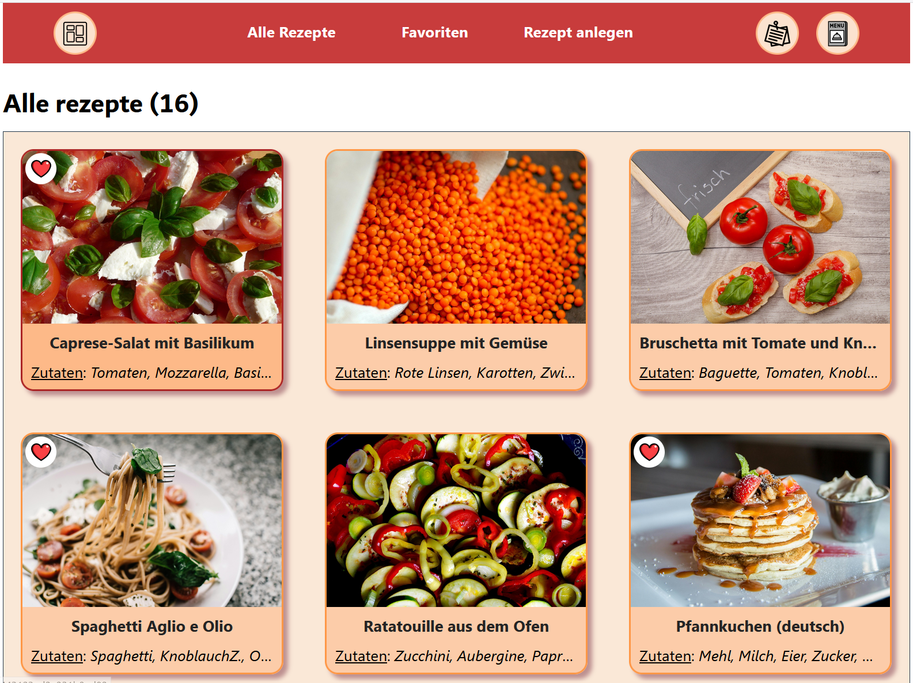

## Projektbeschreibung

Das ist ein Full-Stack Capstone Projekt, das Java / SpringBoot (Backend) sowie React / TypeScript (Frontend) und externe OpenAI-API (zum Abfragen von Informationen über unbekannte Zutaten) kombiniert.

Die Rezeptsammlung App ist eine webbasierte Plattform zum Anlegen, Bearbeiten und Verwalten von Rezepten verschiedener Art. 
Mit der Anwendung ist es möglich, aus den vorhandenen Rezepten einen Speiseplan (bzw. mehrere Speisepläne) zu einem bevorstehenden Anlass zusammenzustellen.
Die App ist mit der OpenAI-API verbunden, sodass man bei Bedarf Informationen über unbekannte Zutaten, deren Verwendung und geeignete Ersatzprodukte von der KI abfragen kann.

## ✨ Implementierte Features

- Rezepterstellung
- Rezeptbearbeitung und Löschen
- Navigation von der Rezeptliste zur Rezeptansicht
- Dashboard mit Filterung nach Rezeptkategorien und Navigation zum bestimmten Rezept
- Favorisieren von Rezepten
- Navigation zur Favoritentabelle mit der Sortierungsmöglichkeit
- Erstellen / Löschen von Speiseplänen
- Custom-Dialog für die Speiseplan-Erstellung
- Hinzufügen von Rezepten zu einem Speiseplan nach einer der zwei Möglichkeiten: in einer Rezeptansicht und in der Favoritentabelle
- Entfernen von Rezepten von einem Speiseplan
- Durchsicht der Zutaten aller Rezepte des aktiven Speiseplans
- Navigation zu einer Seite, auf der man die KI nach einer unbekannten Zutat fragen kann
- User-Benachrichtigung mit Toast-Messages
- Navigation zu einer Seite mit zusätzlichen nützlichen Informationen
- Navigation zur Quellen-Liste für die in App benutze Icons (im Footer)
- Navigation zur AppCode-Source in GitHub (im Footer)

## 🎯 Zukunft-Vision

- Loginfunktion
- Suchfunktion
- Paginierung
- Internationalisierung
- Zutatenberechnung-Funktion für eine Speiseplan-Einkaufsliste
- Druckfunktion (.pdf) für eine Einkaufsliste
- Bessere Felder-Validierung
- Responsive Design für alle Geräte
- Performance-Optimierung

---

    RezeptsammlungApp - alle Rezepte an einem Ort!

---
